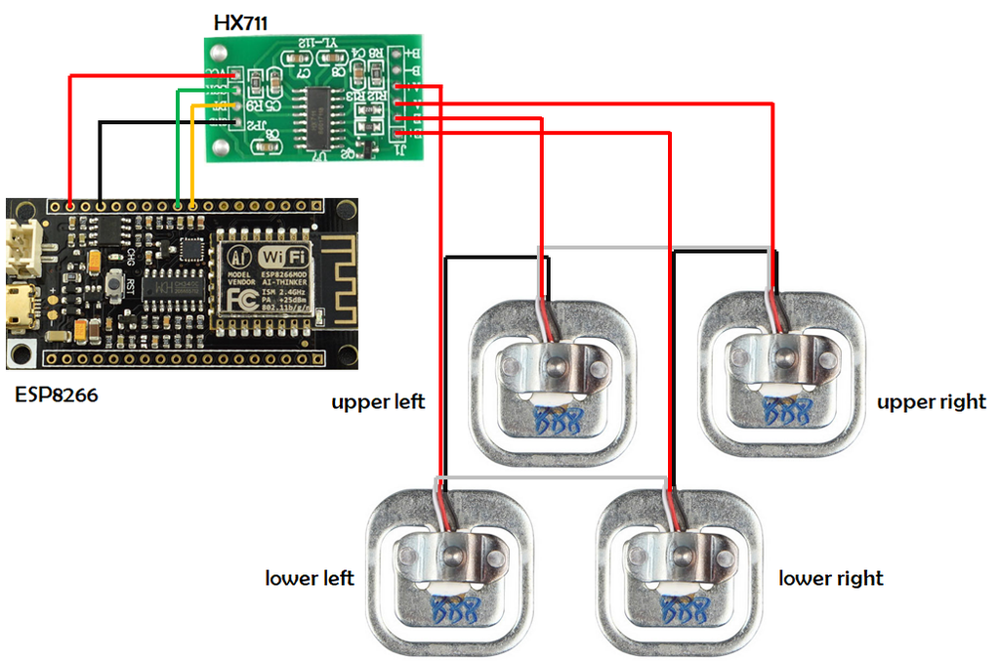

<output>
# Arduino and ESP8266 (or NodeMCU) Projects

## Table of Contents
1. [Projects](#projects)
   - [LED Control](#iot_led_over_esp8266_nodemcu)
   - [OTA Updates](#esp8266_nodemcu_basicota)
   - [CSV SD Logging](#iot_csv_sd)
   - [Honeywell I2C Datalogger](#honeywell_i2c_datalogger)
   - [Load Cell Reading](#iot_load_cell_using_esp8266_nodemcu)
   - [SSD1306 Display](#iot_ssd1306_esp8266_nodemcu)
2. [Required Libraries](#required-libraries)
3. [Contact Information](#contact-information)
4. [Additional Resources](#additional-resources)
   - [GitHub Repositories](#github-repositories)
   - [Other Products](#other-products)
   - [YouTube Videos](#youtube-videos)
   - [3D Models](#3d-models)
   - [HuggingFace Models and Datasets](#huggingface)
5. [Blogs and Apps](#blogs-and-apps)

---

## Projects
### [IoT_LED_over_ESP8266_NodeMCU : Turn LED on and off using web server hosted on a nodemcu or esp8266](https://github.com/hemangjoshi37a/my_Arduino/tree/master/IoT_LED_over_ESP8266_NodeMCU)

> Control an LED via a web server hosted on a NodeMCU or ESP8266.

---

### [ESP8266_NodeMCU_BasicOTA : Simple OTA (Over The Air) upload code from Arduino IDE using WiFi to NodeMCU or ESP8266](https://github.com/hemangjoshi37a/my_Arduino/tree/master/ESP8266_NodeMCU_BasicOTA)

> Easily update your NodeMCU or ESP8266 firmware over the air using the Arduino IDE.

---

### [IoT_CSV_SD : Read analog value of Voltage and Current and write it to SD Card in CSV format for Arduino, ESP8266, NodeMCU etc](https://github.com/hemangjoshi37a/my_Arduino/tree/master/IoT_CSV_SD)

> Log analog values of voltage and current to an SD card in CSV format.

---

### [Honeywell_I2C_Datalogger : Log data in SD Card from a Honeywell I2C HIH8000 or HIH6000 series sensor having external I2C RTC clock](https://github.com/hemangjoshi37a/my_Arduino/tree/master/Honeywell_I2C_Datalogger)

> Log data from Honeywell I2C sensors with integrated RTC clock.

---

### [IoT_Load_Cell_using_ESP8266_NodeMC : Read ADC value from High Precision 12bit ADS1015 ADC Sensor and Display on SSD1306 SPI Display as progress bar for Arduino or ESP8266 or NodeMCU](https://github.com/hemangjoshi37a/my_Arduino/tree/master/IoT_Load_Cell_using_ESP8266_NodeMC)

> Read and display load cell data using ESP8266 and high precision ADC.

---

### [IoT_SSD1306_ESP8266_NodeMCU : Read from High Precision 12bit ADC sensor ADS1015 and display to SSD1306 SPI as progress bar in ESP8266 or NodeMCU or Arduino](https://github.com/hemangjoshi37a/my_Arduino/tree/master/IoT_SSD1306_ESP8266_NodeMCU)

> Display ADC sensor data on an SSD1306 screen with NodeMCU or Arduino.

---

## Required Libraries
Find all the necessary libraries for these projects [here](https://github.com/hemangjoshi37a/my_Arduino/tree/master/libraries).

---

## 📫 How to reach me
 &nbsp;
 &nbsp;
 &nbsp;
 &nbsp;
 &nbsp;
 &nbsp;
 &nbsp;
 &nbsp;
 &nbsp;
 &nbsp;
 &nbsp;
 &nbsp;
 &nbsp;
 

---

## Additional Resources
### GitHub Repositories
- [pyPortMan](https://github.com/hemangjoshi37a/pyPortMan)
- [transformers_stock_prediction](https://github.com/hemangjoshi37a/transformers_stock_prediction)
- [TrendMaster](https://github.com/hemangjoshi37a/TrendMaster)
- [hjAlgos_notebooks](https://github.com/hemangjoshi37a/hjAlgos_notebooks)
- [AutoCut](https://github.com/hemangjoshi37a/AutoCut)
- [My_Projects](https://github.com/hemangjoshi37a/My_Projects)
- [Cool Arduino and ESP8266 or NodeMCU Projects](https://github.com/hemangjoshi37a/my_Arduino)
- [Telegram Trade Msg Backtest ML](https://github.com/hemangjoshi37a/TelegramTradeMsgBacktestML)

---

### Other Products
- [WiFi IoT LED Matrix Display](https://hjlabs.in/product/wifi-iot-led-display)
- [SWiBoard WiFi Switch Board IoT Device](https://hjlabs.in/product/swiboard-wifi-switch-board-iot-device)
- [Electric Bicycle](https://hjlabs.in/product/electric-bicycle)
- [Product 3D Design Service with Solidworks](https://hjlabs.in/product/product-3d-design-with-solidworks/)
- [AutoCut : Automatic Wire Cutter Machine](https://hjlabs.in/product/automatic-wire-cutter-machine/)
- [Custom AlgoTrading Software Coding Services](https://hjlabs.in/product/custom-algotrading-software-for-zerodha-and-angel-w-source-code/)
- [SWiBoard : Tasmota MQTT Control](https://play.google.com/store/apps/details?id=in.hjlabs.swiboard)
- [Custom Token Classification or Named Entity Recognition (NER) model as in Natural Language Processing (NLP) Machine Learning](https://hjlabs.in/product/custom-token-classification-or-named-entity-recognition-ner-model-as-in-natural-language-processing-nlp-machine-learning/)

---

### YouTube Videos
- [❤️ હદય અને હદયના ધબકારા 💙 दिल और दिल की धड़कन 💖 Heart and beating of heart by Priyanka madam. 💕](https://www.youtube.com/watch?v=9v3MK6oTOeA)
- [🩸 רer ל> Blood Vessels and Working of Blood Vessels 🩸 By Priyankama'am](https://www.youtube.com/watch?v=T7mMcEYNKyQ)
- [🩸 Ver : Blood Circulation System in Humans 🩸 By Priyanka madam](https://www.youtube.com/watch?v=vxa6o_wrWnY)
- [AutoCut V2 - The World's Most Powerful Arduino Automatic Wire Cutting Machine](https://www.youtube.com/watch?v=oGr0mWmNhKY)
- [SWiBoard - A Killer Gadget to Boost Your Boring Switchboard](https://www.youtube.com/watch?v=ftza6WM4LiE)
- [🧪 Ver](https://www.youtube.com/watch?v=UUGI-CFKsWI)
- [ociação /n>](https://youtu.be/1da9p6iYlr4)
- [<er/va מא0 Transpiration in Trees](https://youtu.be/I9Sirc42Ktg)
- [Breathing in organisms 👩🏻‍🔬](https://youtu.be/sIMl4t2OFmY)
- [Itrova](https://youtu.be/hua8ZD5Ge1w)
- [ousi](https://youtu.be/BI-CYgnkGCw)

---

### HuggingFace Models and Datasets 
- [hemangjoshi37a/autotrain-ratnakar_1000_sample_curated-1474454086 : Stock tip message NER(Named Entity Recognition or Token Classification) using HUggingFace-AutoTrain and LabelStudio and Ratnakar Securities Pvt. Ltd.](https://huggingface.co/hemangjoshi37a/autotrain-ratnakar_1000_sample_curated-1474454086)
- [hemangjoshi37a/autotrain-data-ratnakar_1000_sample_curated : Stock tip message NER(Named Entity Recognition or Token Classification) using HUggingFace-AutoTrain and LabelStudio and Ratnakar Securities Pvt. Ltd.](https://huggingface.co/datasets/hemangjoshi37a/autotrain-data-ratnakar_1000_sample_curated)

---

## Blogs and Apps
### Blog
- [Hemang Joshi](http://hemangjoshi.blogspot.com/)

### Apps
- [SWiBoard : Tasmota MQTT Control](https://play.google.com/store/apps/details?id=in.hjlabs.swiboard)

---

## GitLab Repositories
- [pyPortMan](https://gitlab.com/hemangjoshi37a/pyPortMan)
- [transformers_stock_prediction](https://gitlab.com/hemangjoshi37a/transformers_stock_prediction)
- [TrendMaster](https://gitlab.com/hemangjoshi37a/TrendMaster)
- [hjAlgos_notebooks](https://gitlab.com/hemangjoshi37a/hjAlgos_notebooks)
- [AutoCut](https://gitlab.com/hemangjoshi37a/AutoCut)
- [My_Projects](https://gitlab.com/hemangjoshi37a/My_Projects)
- [Cool Arduino and ESP8266 or NodeMCU Projects](https://gitlab.com/hemangjoshi37a/my_Arduino)
- [Telegram Trade Msg Backtest ML](https://gitlab.com/hemangjoshi37a/TelegramTradeMsgBacktestML)
</output>
