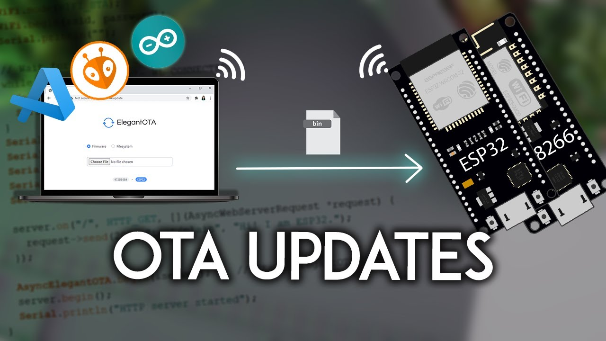

# Arduino and ESP8266 (or NodeMCU) projects

## IoT_LED_over_ESP8266_NodeMCU : Turn LED on and off using web server hosted on a nodemcu or esp8266  

## ESP8266_NodeMCU_BasicOTA : Simple OTA (Over The Air) upload code from Arduino IDE using WiFi to NodeMCU or ESP8266  

## IoT_CSV_SD : Read analog value of Voltage and Current and write it to SD Card in CSV format for Arduino, ESP8266, NodeMCU etc  

## Honeywell_4_20mA_Datalogger : Log data in A SD Card from a Honeywell I2C HIH8000 or HIH6000 series sensor having external I2C RTC clock

<iframe width="560" height="315" src="https://www.youtube.com/embed/MC9E-f79TsQ" title="YouTube video player" frameborder="0" allow="accelerometer; autoplay; clipboard-write; encrypted-media; gyroscope; picture-in-picture" allowfullscreen></iframe>

<iframe width="560" height="315"
src="https://www.youtube.com/embed/ySsQuUL6oOM"
frameborder="0"
allow="accelerometer; autoplay; encrypted-media; gyroscope; picture-in-picture"
allowfullscreen></iframe>

## IoT_Load_Cell_using_ESP8266_NodeMC : Read ADC value from High Precision 12bit ADS1015 ADC Sensor and Display on SSD1306 SPI Display as progress bar for Arduino or ESP8266 or NodeMCU

## IoT_SSD1306_ESP8266_NodeMCU : Read from High Precision 12bit ADC seonsor ADS1015 and display to SSD1306 SPI as progress bar in ESP8266 or NodeMCU or Arduino  

----------------------------------------------------------------------

Place a custom order on hjLabs.in : [https://hjLabs.in](https://hjlabs.in/)

Plese feel free to use the codes for yourself.

And also suggestions and pull requests are welcome for code improvement.

Thax and regards.
Peace.

--

### Checkout Our Other Repositories

- [pyPortMan](https://github.com/hemangjoshi37a/pyPortMan)
- [transformers_stock_prediction](https://github.com/hemangjoshi37a/transformers_stock_prediction)
- [TrendMaster](https://github.com/hemangjoshi37a/TrendMaster)
- [hjAlgos_notebooks](https://github.com/hemangjoshi37a/hjAlgos_notebooks)
- [AutoCut](https://github.com/hemangjoshi37a/AutoCut)
- [My_Projects](https://github.com/hemangjoshi37a/My_Projects)

### Checkout Our Other Products

- [WiFi IoT LED Matrix Display](https://hjlabs.in/product/wifi-iot-led-display)
- [SWiBoard WiFi Switch Board IoT Device](https://hjlabs.in/product/swiboard-wifi-switch-board-iot-device)
- [Electric Bicycle](https://hjlabs.in/product/electric-bicycle)
- [Product 3D Design Service with Solidworks](https://hjlabs.in/product/product-3d-design-with-solidworks/)
- [AutoCut : Automatic Wire Cutter Machine](https://hjlabs.in/product/automatic-wire-cutter-machine/)
- [Custom AlgoTrading Software Coding Services](https://hjlabs.in/product/custom-algotrading-software-for-zerodha-and-angel-w-source-code//)
- [SWiBoard :Tasmota MQTT Control App](https://play.google.com/store/apps/details?id=in.hjlabs.swiboard)
